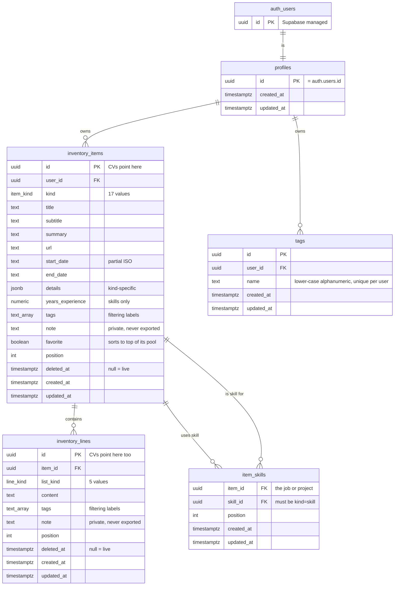
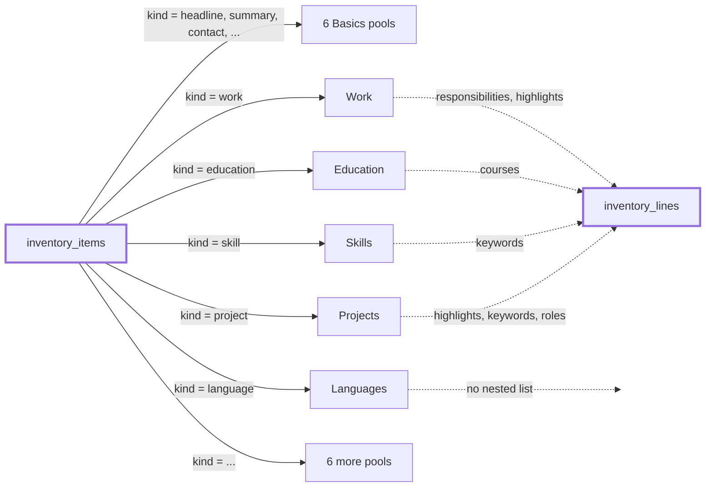
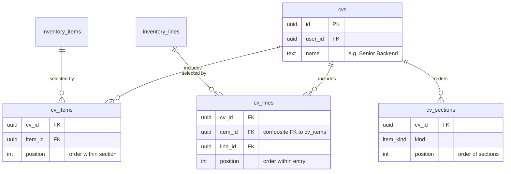

# 02 — Inventory Schema Diagram

Visual companion to [02 — Inventory Data Model](02-inventory-data-model.md).
That document is the authority; this one exists to make the shape obvious.

---

## Entity relationship



`item_skills` has no `deleted_at` on purpose — a link is not content, and its composite
primary key would collide with re-adding the same link. See Soft delete in the data model.
`tags` has none either: it is metadata, and a deleted tag is retyped in seconds.

**The dashed relation the diagram cannot draw.** The `tags` arrays on `inventory_items`
and `inventory_lines` hold names from the `tags` registry, but Postgres cannot
foreign-key an array element — a trigger and the application enforce it instead. See
Tags in the data model.

---

## Relations

| From | To | Type | On delete |
|---|---|---|---|
| `auth.users` | `profiles` | one-to-one | cascade |
| `profiles` | `inventory_items` | one-to-many | cascade |
| `inventory_items` | `inventory_lines` | one-to-many | cascade |
| `inventory_items` | `inventory_items` | many-to-many via `item_skills` | cascade |
| `profiles` | `tags` | one-to-many | cascade |

Five tables. Deleting a user removes everything below it.

The last relation is self-referencing: a Work entry points at Skill entries in the same
table. That is how "which skills did I use at Acme?" and "which jobs used Postgres?"
are both answerable from one link.

---

## How one table becomes seventeen pools

`inventory_items` is a single table. The `kind` column is what splits it into the
pools the user sees as separate pages.



Solid lines are `kind` filters on one table. Dotted lines show which pools have nested
lines and which `list_kind` they use. Languages, Awards, Certificates, Publications,
References, and all six Basics pools have no nested lines at all.

---

## Where a CV attaches

Not built yet — shown so the shape of the next spec is visible. Both selection tables
hang off ids that already exist.



Join tables with real foreign keys. Because they cascade, deleting an Inventory item
removes it from every CV automatically — no triggers, no application code.

`position` appears at all three levels, so two CVs can share the same rows and still
order sections, entries, and bullets differently.

`cv_lines` carries `item_id` so it can point at `cv_items` with a composite foreign key.
That is what makes an orphan bullet — one whose parent entry is not on the CV —
impossible to write, and deselecting an entry drops its bullets automatically.

---

## Worked example

One job in the Inventory, appearing differently on two CVs.

```
inventory_items
  id=a1  kind=work  title="Acme"  subtitle="Backend Engineer"
                    start_date="2022"  end_date="2024"
                    summary="Owned the payments platform end to end."

inventory_lines                        (item_id=a1, list_kind=responsibilities)
  id=c1  position=0  "Owned payments API"                 tags={backend}
  id=c2  position=1  "Ran on-call rotation"               tags={ops}
  id=c3  position=2  "Reviewed code"                      tags={leadership}

inventory_lines                        (item_id=a1, list_kind=highlights)
  id=b1  position=0  "Built REST API with Node.js"        tags={backend, api}
  id=b2  position=1  "Led a team of 4 engineers"          tags={leadership}
  id=b3  position=2  "Reduced database query time by 60%" tags={backend, performance}
  id=b4  position=3  "Designed React dashboard"           tags={frontend}
  id=b5  position=4  "Set up CI/CD pipeline"              tags={backend, devops}

cv_items    cv=Backend   → item a1
cv_lines    cv=Backend   → c1, b1, b3, b5   (filtered by tag `backend`)

cv_items    cv=TeamLead  → item a1
cv_lines    cv=TeamLead  → c3, b2, b3
```

The same row `a1` serves both CVs. Only the selected line ids differ. Editing `b3`
updates both CVs at once — which is the agreed behaviour, since bullet text is never
rewritten per CV.

Tags are what make the Backend selection quick: filter to `backend` and the three
relevant bullets surface immediately. They are a build-time aid only — never rendered
on a CV, and stripped from `resume.json` export.
